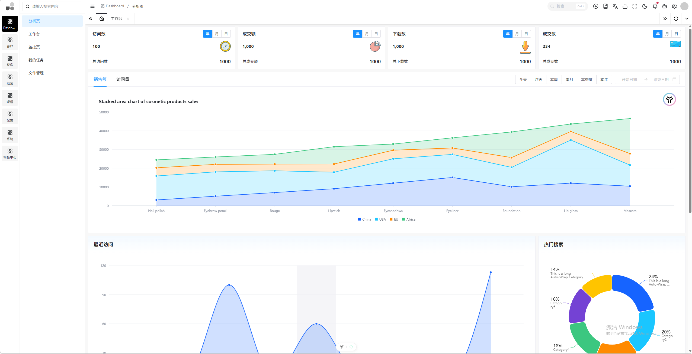
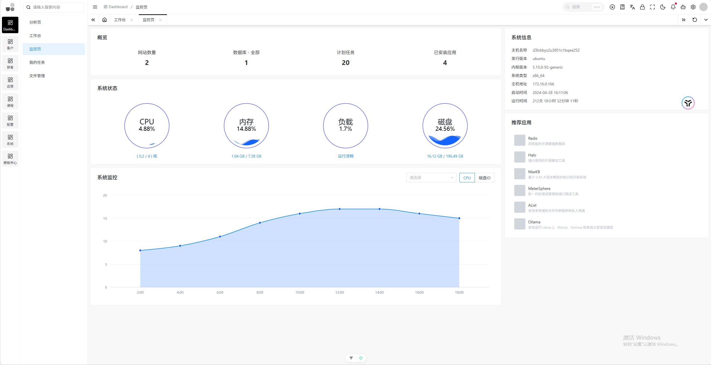
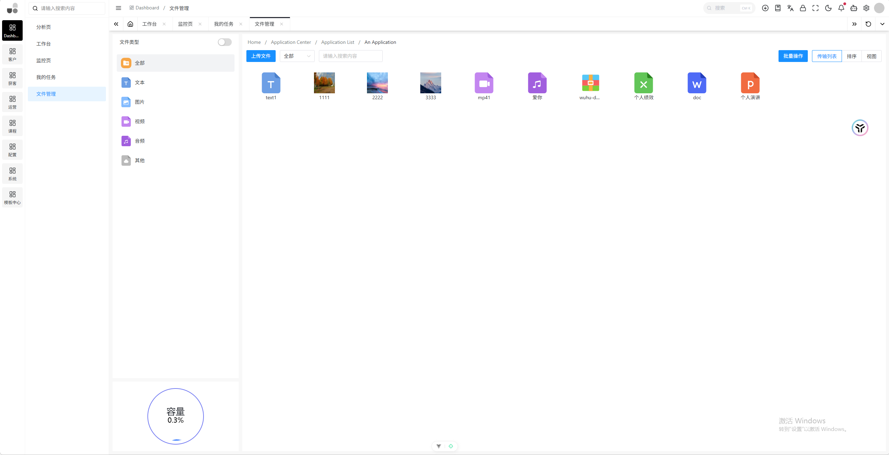
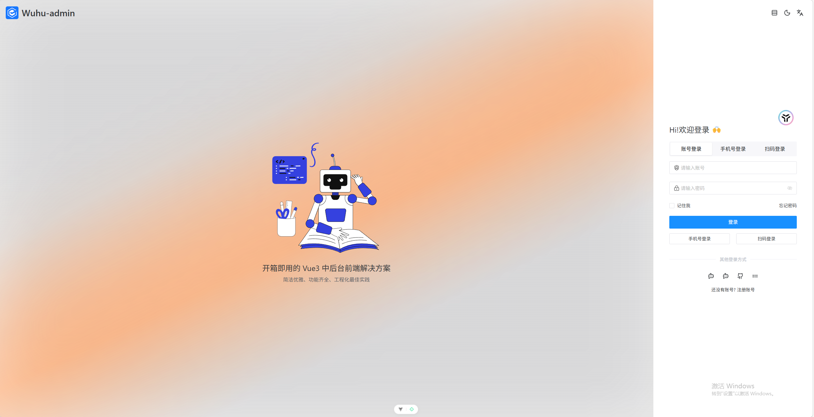
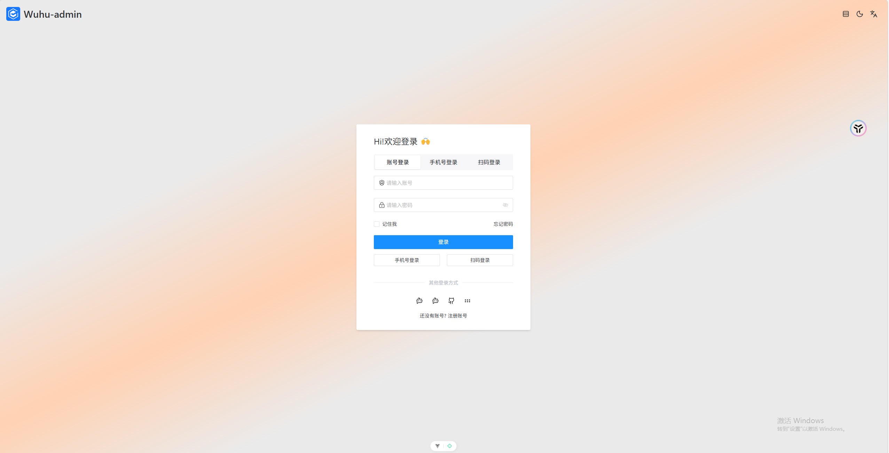

<h1 align="center">Wuhu-vue-admin</h1>

**English** | [中文](README.zh-CN.md)

## Introduction

Wuhu-vue-admin is a back-end management system implemented with Vue3.x + Pinia + VueRouter + Unocss + Vite + NaiveUI + TypeScript. It supports out-of-the-box functionality and comes with built-in enterprise-level common solutions, facilitating rapid development for enterprise-level needs.







## 1. Project Structure

- src/assets: Directory for storing static resources.
- src/common: The directory for storing general configurations, including configurations for the left menu, etc.
- src/components: Directory for common components.
- src/constant: A directory for generic constants (used to reduce the runtime overhead of enums).
- src/composables: Directory for generic composable functions (Composables).
- src/layouts: Directory for page layouts.
- src/locale: Directory for storing multiple language packs.
- src/router: directory related to routing.
- src/store: Directory for global state management.
- src/style: Directory for global style files.
- src/utils: directory for general utilities.
- src/views: directory for storing page view files.
- build: Vite build configuration directory.
- mock: mock file directory.
- typings: directory for global TypeScript type declarations.
- uno: unocss configuration directory.

## 2. Project Specifications

### Git Commit Guidelines

Git commit format:

```
# git commit commit format
git commit -m "type(scope) : subject"
# Example 1
git commit -m "feat: added Butto component"
```

commit subject:

- feat(feature): Indicates the addition of a new feature or enhancement.
- fix: indicates fixing a bug or issue.
- docs: Indicates changes that only involve documents, such as updating documents, adding comments, etc.
- style: Refers to modifications made to code style and formatting, which do not affect the code's logic (such as changes to spaces, indentation, semicolons, etc.).
- refactor: Refers to the restructuring of code, which is neither a bug fix nor a modification to add new functionality.
- perf (performance): Refers to modifications aimed at performance optimization.
- test: Indicates adding, modifying, or deleting test-related code.
- chore: Refers to changes made to the build process or auxiliary tools and libraries that do not affect the production code (e.g., updating build scripts, configuration files, etc.).
- build: indicates changes related to the build system, such as updating dependencies, changes to version management tools, etc.
- ci (continuous integration): indicates changes related to the continuous integration process.
- revert: It indicates undoing the previous commit.
- merge: A workflow type indicating the merging of branches, typically used for merging development branches or feature branches into the main branch.
- release: Indicates the type of release workflow, used for version release or management.
- hotfix: indicates the type of hotfix workflow, typically used for urgent fixes to issues in production environments.
- init: Indicates the initialization workflow type, used for project initialization or initial submission.
- workflow: indicates the type of workflow or process submitted, to better understand the context and purpose of the submission.
- wip: wip is an abbreviation for Work In Progress, indicating that the submission is still in development or not yet completed.
