<div align="center">
  
  <h1>Wuhu Vue Admin</h1>
  <p>A feature-rich Vue administration application and implementation reference.</p>

  <p>
    <a href="https://vuejs.org/"></a>
    <a href="https://vite.dev/"></a>
    <a href="https://www.typescriptlang.org/"></a>
    <a href="./LICENSE"></a>
  </p>

  <p><a href="./README.zh-CN.md">中文</a> · <strong>English</strong></p>
</div>

Wuhu Vue Admin combines a configurable admin shell with dashboards, system modules, workflow tooling, communication views, AI workspace examples, and reusable complex components. It is intended for building and evaluating modern management products rather than serving as a finished backend service.

Development mode includes local mock endpoints for authentication, users, and roles. Many template pages also ship with sample data, so the main interactions can be explored without a backend.

## Highlights

| Area                 | Included capabilities                                                                                                                                         |
| -------------------- | ------------------------------------------------------------------------------------------------------------------------------------------------------------- |
| Application shell    | Multi-level navigation, tabs and keep-alive, global search, theme switching, i18n, lock screen, task/download/notice centers, and configurable header widgets |
| Dashboards           | Analysis, workbench, system monitor, task board, file manager, and ticket workflows                                                                           |
| Business modules     | Customer management, articles, users, roles, departments, menus, dictionaries, files, notices, and audit logs                                                 |
| Designers            | Low-code, report, chart, approval-flow, and workflow designers with local preview data                                                                        |
| Communication and AI | IM-style chat, global message search, Agent management, AI chat, and knowledge-base views                                                                     |
| Components           | Tiptap editor, CodeMirror, cropper, Gantt, JSON viewer, file preview, icon tools, virtualized content, and drag-and-drop examples                             |
| Engineering          | Route contract validation, mock APIs, strict TypeScript, UnoCSS semantic tokens, bundle analysis, and gzip size budgets                                       |

## Preview

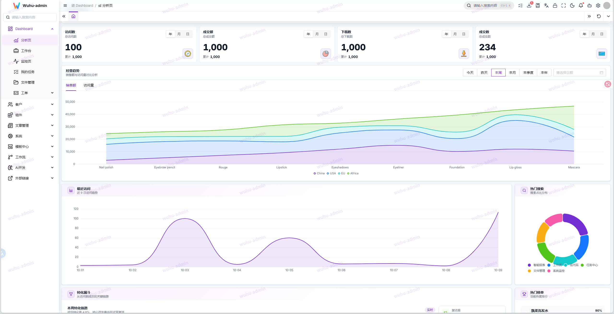
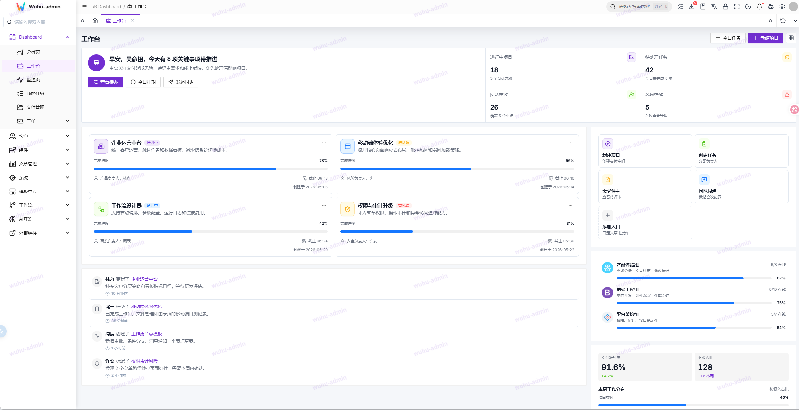
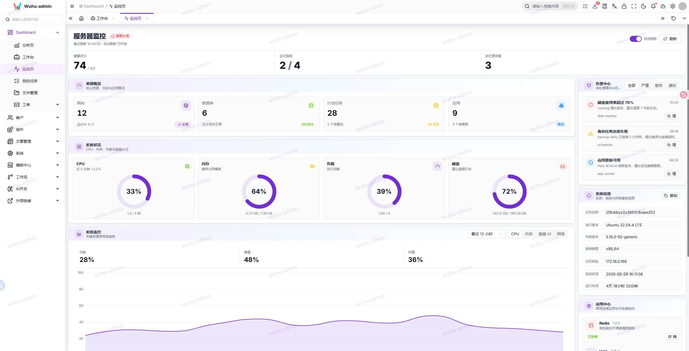
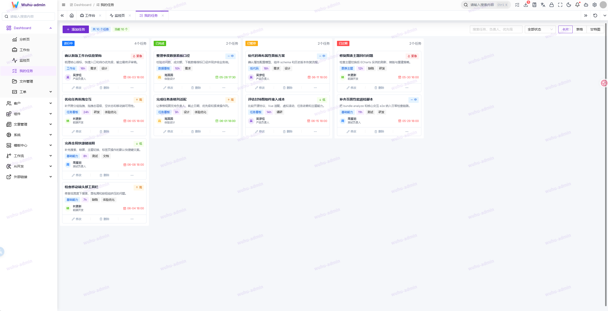
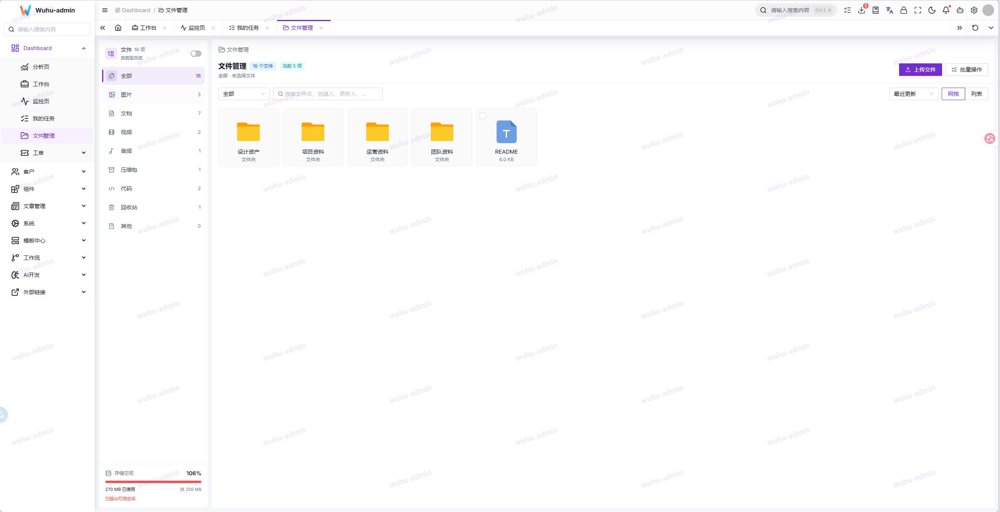
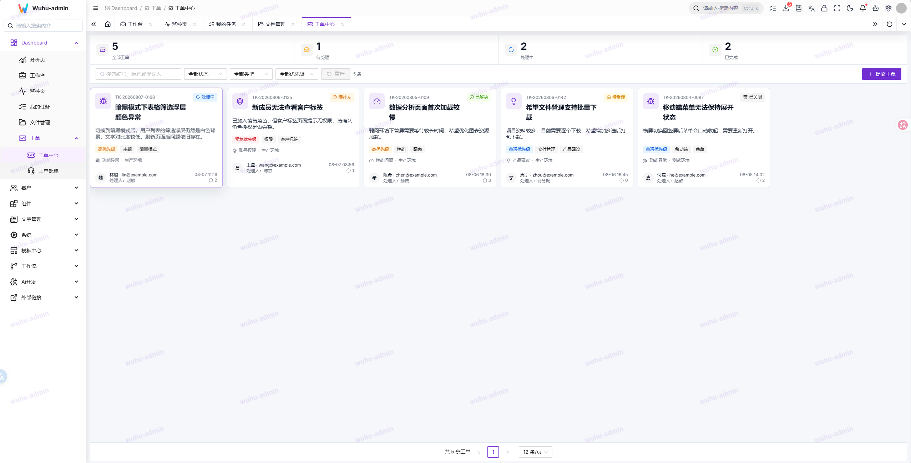
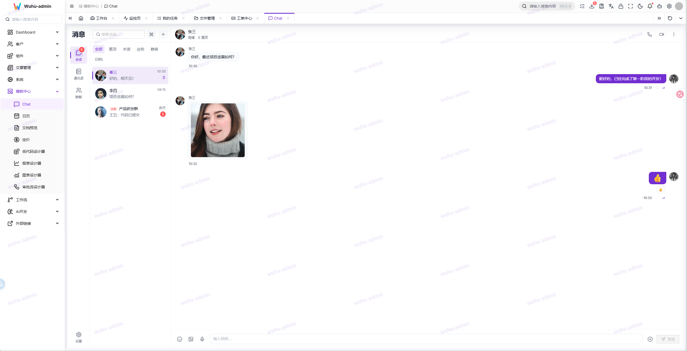
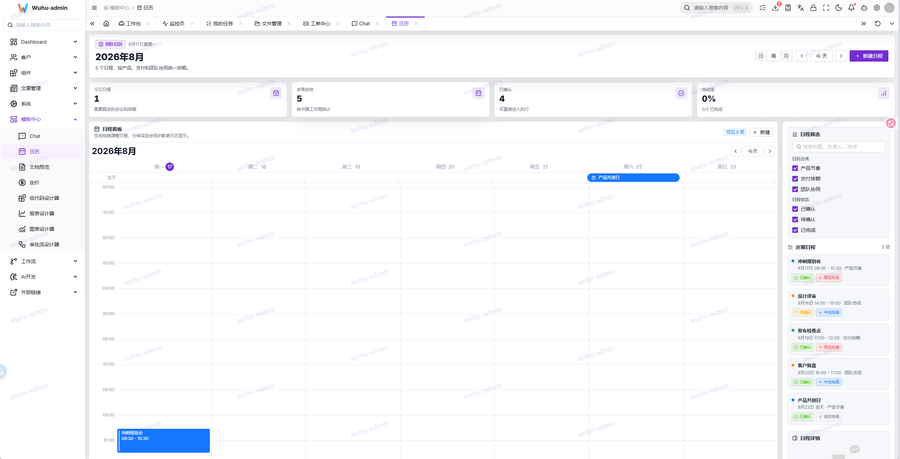
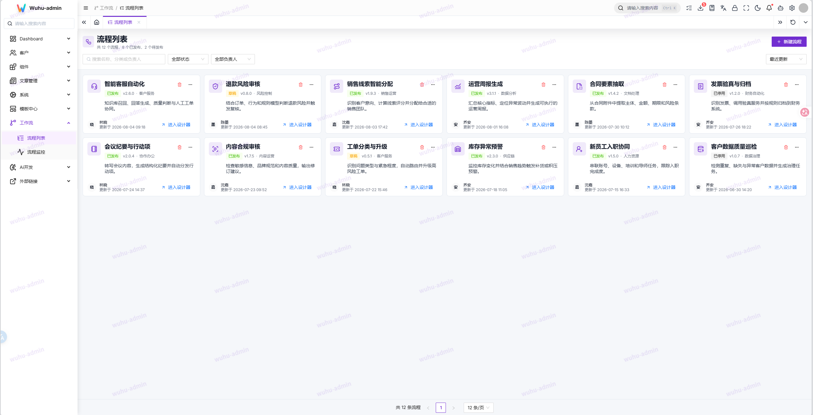
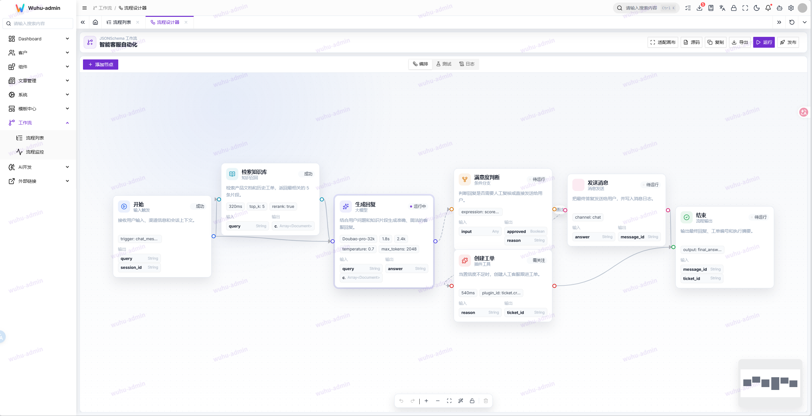
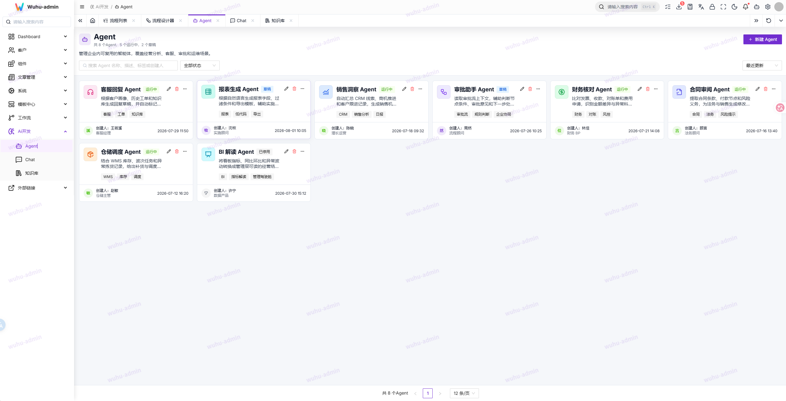
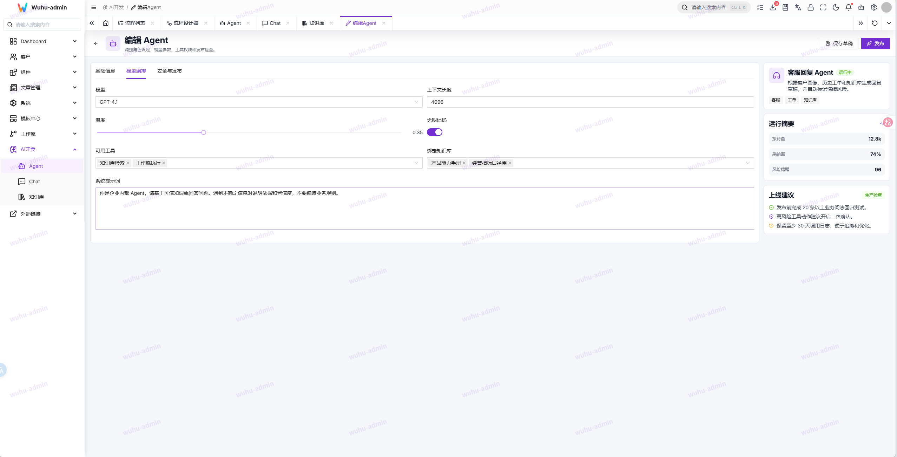
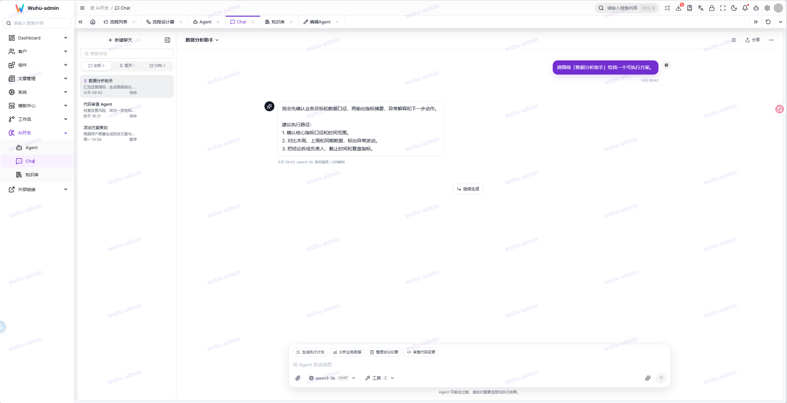
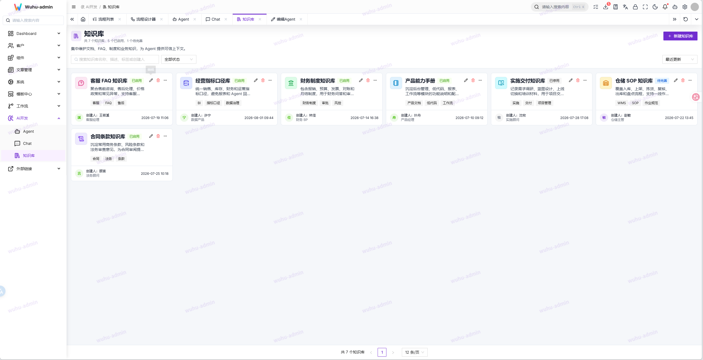

## Tech Stack

| Category       | Technology                                                |
| -------------- | --------------------------------------------------------- |
| Core           | Vue 3, TypeScript, Pinia, Vue Router, Vue I18n, VueUse    |
| UI and styling | Antdv Next, UnoCSS, Less, Lucide icons, OverlayScrollbars |
| Visualization  | ECharts, Vue Flow, Frappe Gantt                           |
| Editing        | Tiptap, CodeMirror, Cropper.js, DOMPurify                 |
| Interaction    | Motion Vue, dnd-kit, Swapy, Viselect, TanStack Virtual    |
| Tooling        | Vite 8, pnpm 10, Oxlint, Oxfmt, Stylelint                 |

## Requirements

- Node.js 24.x
- pnpm 10.x

## Quick Start

```bash
git clone https://github.com/yibird/wuhu-vue-admin.git
cd wuhu-vue-admin
pnpm install
pnpm dev
```

Open [http://localhost:5555](http://localhost:5555). The development mock accepts any non-empty account and password; `admin` / `admin` can be used locally.

## Environment Variables

Vite loads shared and mode-specific files from the `env` directory. Development uses `env/.env` and `env/.env.development`; production uses `env/.env` and `env/.env.production`.

| Variable                        | Default                 | Purpose                                     |
| ------------------------------- | ----------------------- | ------------------------------------------- |
| `VITE_APP_NAME`                 | `Wuhu-admin`            | Brand name rendered by the application      |
| `VITE_APP_TITLE`                | `Wuhu-admin`            | Browser and application title               |
| `VITE_PORT`                     | `5555`                  | Development server port                     |
| `VITE_API_BASE_URL`             | `/api`                  | HTTP client base URL                        |
| `VITE_API_PROXY_URL`            | `http://localhost:8080` | Development proxy target                    |
| `VITE_CDN`                      | `false`                 | Enable the production CDN import plugin     |
| `VITE_IMAGE_OPTIMIZER`          | `false`                 | Enable production image optimization        |
| `VITE_PERFORMANCE_GUARD_STRICT` | `true` in builds        | Fail builds on performance guard violations |

## Main Scripts

| Command              | Description                                                |
| -------------------- | ---------------------------------------------------------- |
| `pnpm dev`           | Start the development server with local mock APIs          |
| `pnpm build`         | Validate routes, type-check, and create a production build |
| `pnpm build:test`    | Build with the `test` environment mode                     |
| `pnpm preview`       | Preview the production build locally                       |
| `pnpm routes:check`  | Verify active menu paths resolve to route components       |
| `pnpm typecheck`     | Run Vue and TypeScript project checks                      |
| `pnpm lint`          | Run Oxlint                                                 |
| `pnpm lint:style`    | Lint Vue, Less, and CSS styles                             |
| `pnpm fmt:check`     | Check formatting with Oxfmt                                |
| `pnpm analyze`       | Build and generate bundle analysis output                  |
| `pnpm bundle:check`  | Check an existing `dist` directory against gzip budgets    |
| `pnpm build:analyze` | Run bundle analysis and then enforce bundle budgets        |

## Commit, Review, and Release Workflow

The repository currently uses Husky for local Git checks and `standard-version` for manual releases. GitHub Actions, automatic release PRs, and production deployment are not configured in this repository yet.

### 1. Install the project

Run the installation once after cloning:

```bash
pnpm install
```

The `prepare` script initializes Husky. After that, commits created in this working copy run the repository hooks automatically.

### 2. Create a branch and make changes

Use a short-lived branch for a feature or fix instead of committing directly to `main`:

```bash
git switch -c feat/ticket-center
```

Keep each commit focused. The commit type should describe the user-visible or engineering change:

| Type       | Meaning                              |
| ---------- | ------------------------------------ |
| `feat`     | Add a feature                        |
| `fix`      | Fix a bug                            |
| `refactor` | Change structure without behavior    |
| `perf`     | Improve performance                  |
| `docs`     | Change documentation                 |
| `test`     | Add or update tests                  |
| `build`    | Change build tooling or dependencies |
| `ci`       | Change CI configuration              |
| `chore`    | Other maintenance                    |

### 3. Commit changes

The recommended interactive command is:

```bash
pnpm commit
```

It opens the configured `cz-git` prompt. You can also commit directly when using the same format:

```bash
git add src/views/dashboard/ticket
git commit -m "feat(ticket): add ticket center"
```

The expected format is:

```text
<type>(<scope>): <subject>
```

The scope is optional. Breaking changes should use `!` and/or include a `BREAKING CHANGE:` footer.

### 4. What runs during a commit

Husky runs two hooks:

1. `pre-commit` runs `lint-staged`. It checks and, where configured, fixes only staged JavaScript, TypeScript, Vue, CSS, Less, JSON, and Markdown files with Oxlint, Oxfmt, Stylelint, or the matching formatter.
2. `commit-msg` runs Commitlint. It rejects commit messages that do not follow the allowed Conventional Commit types.

If a hook fails, fix the reported issue and run the commit again. The normal workflow should not bypass hooks with `--no-verify`.

### 5. Validate before opening a PR

Run the checks relevant to the change. For a broad change, use:

```bash
pnpm routes:check
pnpm typecheck
pnpm lint
pnpm lint:style
pnpm fmt:check
pnpm test:unit
pnpm build
```

The aggregate `pnpm check` command additionally runs the route check, unit tests, type check, Oxlint, and Playwright E2E tests. It does not replace the style check or production build, so run those separately when they are relevant.

### 6. Push and review

Push the branch and open a pull request:

```bash
git push -u origin feat/ticket-center
```

Review the diff, screenshots, route changes, environment changes, and any migration notes in the PR. This repository currently has no checked-in GitHub Actions workflow, so CI checks are not automatically run by the repository. The author should run the required local checks before requesting review.

After approval, merge the pull request into the release branch, normally `main`.

### 7. Create a release (current process)

The current release command is:

```bash
pnpm release
```

If the repository has no existing release tag and the current version in `package.json` should become the first release, use:

```bash
pnpm release -- --first-release
```

This creates the first changelog entry, release commit, and tag without incrementing the current package version. To choose an explicit first version instead, use a command such as `pnpm release -- --release-as 0.1.0`. After the first tag exists, use the regular `pnpm release` command.

It runs `standard-version`, which normally:

1. Reads Conventional Commits since the previous tag.
2. Calculates the next version.
3. Creates or updates `CHANGELOG.md`.
4. Updates the version in `package.json`.
5. Creates a release commit such as `chore(release): vX.Y.Z`.
6. Creates a Git tag such as `vX.Y.Z`.

Before releasing, make sure the working tree is clean and the release branch contains the changes to publish:

```bash
git switch main
git pull --ff-only origin main
git status --short
pnpm install --frozen-lockfile
pnpm check
pnpm build
# Use the first-release or regular release command described above.
```

Review the generated changelog, version, release commit, and tag before pushing them. If they are correct, push both the commit and tag:

```bash
git push origin main
git push origin vX.Y.Z
```

Or, when the release commit is already on `main`, push its tags together:

```bash
git push --follow-tags origin main
```

The `pnpm changelog` command only generates or updates changelog content; it does not create a version commit or tag. Use it when you need a preview or a changelog-only update.

### Release notes and current limitations

- A Git tag pushed to GitHub is not the same as a GitHub Release. Create a GitHub Release from the tag manually if the project needs one.
- Production deployment is not defined in this repository. The build artifact is `dist/`; deployment must be handled by the hosting or deployment platform.
- `release-please` has been evaluated as the future release tool, but it is not wired into the current project. Do not expect a release PR or automatic release after pushing to `main` until a GitHub Actions workflow is added.

The intended future flow is:


```mermaid
flowchart LR
  A[Create branch] --> B[Change code]
  B --> C[Commit]
  C --> D[Husky checks]
  D --> E[Push branch]
  E --> F[Pull request review]
  F --> G[Merge main]
  G --> H[release-please release PR]
  H --> I[Merge release PR]
  I --> J[Tag and GitHub Release]
  J --> K[Deploy dist/]
```

## Project Structure

```text
src/
|-- apis/          Backend API adapters and request types
|-- components/    Cross-feature reusable components
|-- composables/   Cross-feature composables
|-- config/        Menu and application configuration
|-- constants/     Shared constants
|-- directives/    Global Vue directives
|-- layouts/       Application shell and layout features
|-- locales/       Locale messages and i18n setup
|-- pages/         Login, registration, and standalone pages
|-- plugins/       Application-level plugin setup
|-- router/        Route registration and guards
|-- store/         Pinia stores
|-- styles/        Global tokens, themes, and transitions
|-- utils/         Shared utilities and HTTP client
  -- views/         Route-level business and template pages
build/             Vite configuration and build plugins
env/               Shared and mode-specific environment files
mock/              Development mock endpoints and sample data
scripts/           Route and bundle validation scripts
types/             Global TypeScript declarations
unocss/            UnoCSS rules, presets, transformers, and shortcuts
```

## Add a Route Page

1. Create the route component at `src/views/<module>/<feature>/index.vue`.
2. Add its menu definition to `src/config/menu.ts` with a stable `id`, `path`, hierarchy, and icon.
3. Keep feature-specific components and composables inside the feature folder; promote them only after cross-feature reuse is established.
4. Run `pnpm routes:check` to verify the menu-to-view contract.

For example, `/template/example` maps to `src/views/template/example/index.vue`. Route pages must not be placed under a feature's `components` directory because the route component scanner intentionally ignores nested component folders.

## Bundle Budgets

Run a production build before checking budgets:

```bash
pnpm build
pnpm bundle:check
```

The default gzip limits are 700 KiB for recursive initial JavaScript, 100 KiB for initial CSS, 3 MiB for a single JavaScript chunk, and 5 MiB for total JavaScript. Override them in CI with `BUNDLE_INITIAL_JS_GZIP_MAX`, `BUNDLE_INITIAL_CSS_GZIP_MAX`, `BUNDLE_SINGLE_JS_GZIP_MAX`, and `BUNDLE_TOTAL_JS_GZIP_MAX`.

## Project Status

The project is currently pre-1.0 and under active development. Mock APIs and sample data are for local preview; replace them with production services and review authentication, permissions, persistence, and error handling before deployment.

## License

[MIT](./LICENSE) © 2026 zchengfeng.
